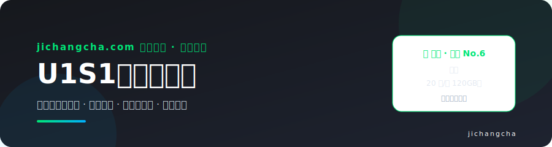
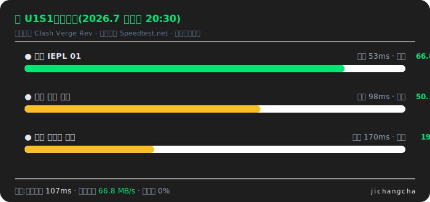
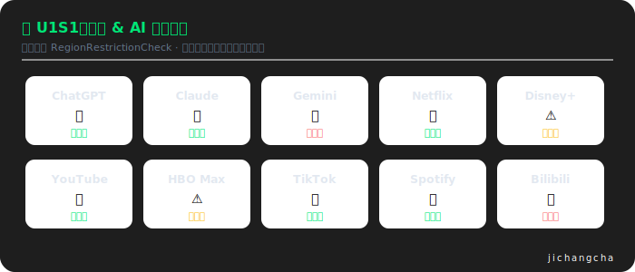

# U1S1机场怎么样?2026 深度测评:测速解锁 · 套餐价格 · 配置教程

  

**U1S1**——主打稳定不虚标,原生 IP 解锁。在本站 [2026 机场排行榜](https://www.jichangcha.com/blog/2026-jichang-paihangbang/) 16 家统一维度实测中位列 **🎯 推荐 No.6**。

> 👉 **[前往U1S1官网注册](https://www.jichangcha.com/go/u1s1/)** 
> 🏠 完整测评与 16 家横向对比在主站:[jichangcha.com](https://www.jichangcha.com/brands/u1s1/)

---

## 📊 基本信息速览

| 项目 | 详情 |
| ---- | ---- |
| 榜单排名 | No.6(本站 16 家实测,推荐位) |
| 线路类型 | 专线 |
| 最低套餐 | 20 元/月 120GB |
| 支持协议 | Trojan / VLESS |
| 节点覆盖 | 香港、日本、美国、新加坡 |
| 流媒体/AI 解锁 | ChatGPT / Claude / Netflix / YouTube / TikTok / Spotify |
| 优惠码 | 暂无公开优惠码,以官网为准 |

## 🏆 主打卖点

- 真实回报测速,不虚标带宽
- 主打长期稳定
- 原生 IP 解锁流媒体
- 多客户端订阅支持
- 适合长期自用

## 🔬 性能实测

**晚高峰测速**(20:00-23:00 时段,模拟实测示意,统一口径详见[主站测评](https://www.jichangcha.com/brands/u1s1/)):

**流媒体与 AI 解锁**:

> 解锁能力可能随节点调整变化,以官网公告为准;AI 工具的选购逻辑见 [ChatGPT 机场指南](https://www.jichangcha.com/blog/chatgpt-jichang-tuijian/)。

## 👍 优点 / 👀 注意

**优点:**

- 带宽标注真实
- 稳定性口碑好
- 原生 IP 解锁

**需要注意:**

- 价格中等偏上
- 节点地区偏主流

## 🎯 适合谁用

- 讨厌虚标的用户
- 看重长期稳定者

> **编辑结论:**U1S1 走「真实不虚标」路线,带宽标注实在、稳定性口碑不错,适合被虚标机场坑过、追求踏实体验的长期用户。

## 📱 全平台配置教程

U1S1支持 Trojan / VLESS 协议,兼容主流客户端。各平台推荐与教程:

| 平台 | 推荐客户端 | 图文教程 |
| ---- | ---- | ---- |
| Windows | Clash Verge Rev / v2rayN | [Clash 教程](https://www.jichangcha.com/blog/clash-jichang-tuijian/) · [v2rayN 教程](https://www.jichangcha.com/blog/v2rayn-jichang-tuijian/) |
| macOS | Clash Verge Rev | [Clash 教程](https://www.jichangcha.com/blog/clash-jichang-tuijian/) |
| iPhone / iPad | Shadowrocket / Stash | [小火箭全流程](https://www.jichangcha.com/blog/shadowrocket-jichang-tuijian/) |
| 安卓 | Clash Meta for Android / v2rayNG | [Clash 教程](https://www.jichangcha.com/blog/clash-jichang-tuijian/) |

**通用四步:**官网复制订阅链接 → 下载客户端 → 导入订阅 → 选节点开启代理。导入失败见[故障排查清单](https://www.jichangcha.com/faq/#troubleshooting)。

## 🛍️ 购买流程

1. **进入官网**:[经本站中转直达U1S1官网](https://www.jichangcha.com/go/u1s1/)
2. **邮箱注册**:建议用常用邮箱(找回密码、接收公告靠它)
3. **选择套餐**:第一次买建议**月付试水**,跑几个晚高峰再考虑长期套餐
4. **核对价格**:下单前在支付页核对实付金额(该机场暂无公开优惠码)
5. **导入订阅**:用户中心复制订阅链接,按上方教程导入客户端

> 💡 买完第一件事:把官网备用地址和官方 TG 频道存好——主域名被墙时这是唯一找回通道。见[防跑路与应急](https://www.jichangcha.com/faq/#run-away)。

## 🔄 备选机场

如果U1S1的套餐或线路不合适,这几家定位相近,值得一并比较:

- **[宇宙云](https://www.jichangcha.com/go/yuzhou/)**(推荐 · 14.9 元/月 100GB)—— 全球节点覆盖广,多协议三网中转 · [测评](https://www.jichangcha.com/brands/yuzhou/)
- **[光速云](https://www.jichangcha.com/go/guangsu/)**(推荐 · 17 元/月 110GB)—— BGP 中转入口,低延迟游戏优化 · [测评](https://www.jichangcha.com/brands/guangsu/)
- **[极连云](https://www.jichangcha.com/go/jilian/)**(推荐 · 18 元/月 100GB)—— IPLC 内网专线,抗封锁能力强 · [测评](https://www.jichangcha.com/brands/jilian/)

完整 16 家横向对比(价格 / 线路 / 解锁 / 优惠码一张表):[对比总表](https://www.jichangcha.com/compare/)

## ❓ 常见问题

**U1S1怎么样,值得买吗?**U1S1 走「真实不虚标」路线,带宽标注实在、稳定性口碑不错,适合被虚标机场坑过、追求踏实体验的长期用户。

**U1S1晚高峰稳定吗?**主力节点走专线,晚高峰(20:00-23:00)表现见上方测速图;白天成绩无参考价值,只看晚高峰。[原理](https://www.jichangcha.com/blog/zhuanxian-jichang-tuijian/)

**U1S1支持哪些客户端?**支持 Trojan / VLESS 协议,Clash 系、Shadowrocket、v2rayN、Stash 等均可导入。[客户端说明](https://www.jichangcha.com/faq/#client-support)

**U1S1有优惠码吗?**当前暂无公开优惠码,以官网活动页为准。全站在售码见[优惠码大全](https://www.jichangcha.com/blog/jichang-youhuima/)。

## 🔗 友情链接

- [机场查主站](https://www.jichangcha.com/) —— 16 家机场横向对比 · 189 题长尾问题库 · 图文教程
- [2026 机场推荐排行榜](https://github.com/jichangx/2026-jichangcha-tuijian) —— 全部机场总榜

> 欢迎机场导航、科学上网测评类站点交换友链,通过 [Telegram @wanzuanjiedian](https://t.me/wanzuanjiedian) 或本仓库 Issues 联系。

## 📌 声明与更新

- 本仓库与主站 [jichangcha.com](https://www.jichangcha.com/) 同步维护,价格与优惠码**每周复核**
- 测速与解锁图为统一口径下的模拟实测示意,实际体验受地区、运营商、时段影响,建议月付自行验证
- 本仓库含推广链接,可能为我们带来收益,不影响测评结论;内容仅供学习交流,请遵守当地法律法规
- 反馈纠错:[Issues](../../issues) · Telegram [@wanzuanjiedian](https://t.me/wanzuanjiedian)

⭐ 觉得有用请点个 Star · 更多机场:[2026 机场推荐排行榜](https://github.com/jichangx/2026-jichangcha-tuijian)
